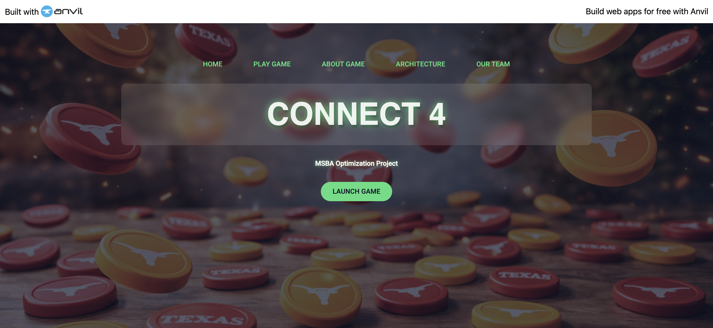
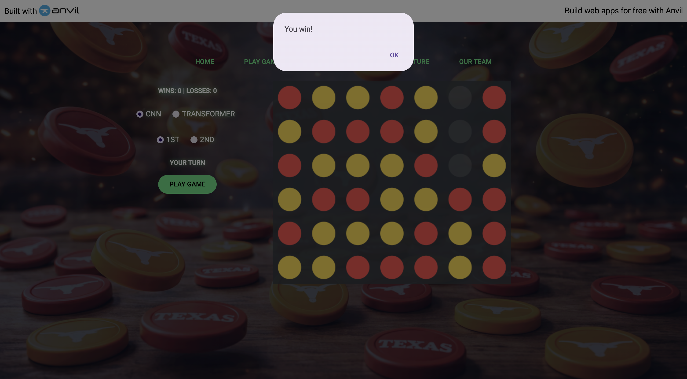

# Connect 4 AI: Data-Driven Strategy and Full-Stack Deployment

This project documents the development of a competitive Connect 4 artificial intelligence. We built a custom dataset, trained two different neural network architectures (a CNN and a Transformer), and deployed the final models to a live web environment using Docker and AWS.

## 1. Data Generation with Monte Carlo Tree Search (MCTS)
The foundation of this project is a high-quality dataset of expert moves. Since Connect 4 is a solved game, we used Monte Carlo Tree Search to act as our "expert" player.

* **Strategic Self-Play**: We allowed the MCTS algorithm to play against itself to identify the optimal move for thousands of unique board positions.
* **Dataset Diversity**: To ensure the models could recover from mistakes, we started some games with several random moves before switching to MCTS, creating a more diverse range of board states.
* **Training Data**: Our final dataset consisted of board representations (the X values) and the specific column moves recommended by the MCTS (the Y values).

## 2. Neural Network Architectures
We developed two distinct models to compare how different mathematical approaches handle game logic.

### Convolutional Neural Network (CNN)
The CNN treats the 6x7 board as a small image. It uses multiple convolutional layers to identify spatial patterns—essentially "looking" for three-in-a-row sequences or open traps across the grid.

### Transformer Model
The Transformer uses a global attention mechanism. We broke the board into overlapping 4x4 patches, allowing the model to weigh the importance of every checker on the board simultaneously. This architecture proved superior in actual gameplay, achieving a 70% win rate against a high-skill MCTS bot.

## 3. Deployment and Infrastructure
To make the AI accessible to users, we built a multi-layered hosting solution.

* **Frontend (Anvil)**: An interactive web interface where players can drop checkers and toggle between the CNN and Transformer opponents.
* **Backend (AWS Lightsail)**: Because heavy machine learning models require significant resources, we hosted the inference engine on an AWS Lightsail instance.
* **Containerization (Docker)**: We packaged the Python environment, TensorFlow models, and connection scripts into a Docker container. This ensures the bot runs in a stable, isolated environment on the cloud.

## 4. Solving Illegal Moves
A common issue with neural networks in games is the prediction of "illegal" moves (e.g., trying to place a checker in a column that is already full). We solved this by implementing a masking layer. Before the AI makes its final choice, the code identifies all legal columns and sets the probability of any illegal move to negative infinity, forcing the model to select the best possible valid move.

## 5. How to Play

The project is live and accessible via the web. Users are required to log in to access the game board and the technical analysis.

**Live Application**: [MSBA25optim2-10.anvil.app](https://MSBA25optim2-10.anvil.app)  (might not work if this repository is too old)

---

### Research and Development Team
* Manny Escalante
* Keerti Rawat
* Niharika Pappu
* Rio Yokoyama

*McCombs School of Business, The University of Texas at Austin*
